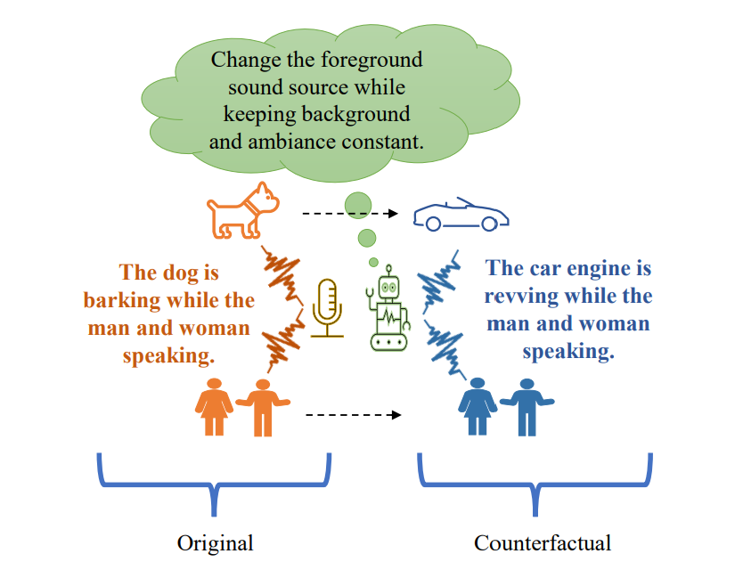

# Learning Audio Concepts from Counterfactual Natural Language



## Abstract

This study introduces causal reasoning and counterfactual analysis in the audio domain, a novel approach to audio classification. Traditional methods are limited to predefined classes and lack the capability to learn from free-form text. Our model advances this field by learning joint audio-text embeddings from raw audio-text pairs describing audio in natural language. We focus on distinguishing sound events and sources in alternative scenarios, such as differentiating fireworks from gunshots at outdoor events. By incorporating counterfactual instances, our model leverages acoustic characteristics and sound source information from human-annotated texts. The effectiveness is validated through pre-training on multiple audio captioning datasets and evaluation on various downstream tasks, showing a significant increase in open-ended language-based audio retrieval task accuracy.

## Experimental Design

**Encoders:**
- **Audio Encoder:** PANNs encoder with ResNet-38 and pretrained weights.
- **Text Encoders:** CLIP text encoder modules from HuggingFace for encoding captions and counterfactuals.

**Data Processing:**
- Logarithmic Mel spectrograms sampled at 32kHz.
- Audio clips truncated to 10-second segments, zero-padding for shorter clips.
- Captions remain unaltered.

**Training Data:**
- 44,292 pairs from AudioCaps, 29,646 pairs from Clotho, and 17,276 pairs from MACS.

**Test Data:**
- **Clotho** dataset for language-based audio retrieval task.
- **ESC-50** and **UrbanSound8K (US8K)** for zero-shot classification in conventional problems.

**Baseline Comparison:**
- Adapted the approach from CLAP, training with AudioCaps, Clotho, and MACS datasets.

## Citation

If you find our paper or code useful in your research, please consider citing:

```bibtex
@inproceedings{counterfactualaudio2024,
  title={Learning Audio Concepts from Counterfactual Natural Language},
  author={Vosoughi, Ali and Bondi, Luca and Wu, Ho-Hsiang and Xu, Chenliang},
  booktitle={2024 IEEE International Conference on Acoustics, Speech, and Signal Processing (ICASSP)},
  year={2024},
  organization={IEEE}
}
