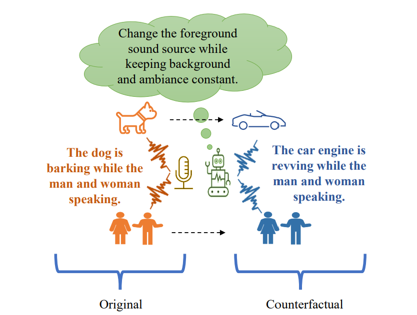

# Counterfactual Audio

Companion repository for the ICASSP 2024 paper
[Learning Audio Concepts from Counterfactual Natural Language](https://arxiv.org/abs/2401.04935).

This repository releases counterfactual text annotations aligned to
human-captioned audio clips from AudioCaps, Clotho, and MACS. Each released
record keeps the original caption(s) and adds a counterfactual alternative for
the same audio clip, making it possible to study audio-text learning with
alternative linguistic scenarios without collecting new audio.

Paper links: [arXiv](https://arxiv.org/abs/2401.04935) |
[IEEE Xplore](https://ieeexplore.ieee.org/document/10446736) |
[GitHub repository](https://github.com/ali-vosoughi/counterfactual-audio)

Project website source: [`docs/`](docs/)



## What is released here

- Counterfactual caption files for AudioCaps, Clotho, and MACS.
- The prompt scaffold used to identify sound sources and rewrite captions.
- A lightweight example script for resolving released entries back to original
  audio paths.
- A ready-to-publish static project website in [`docs/`](docs/).

This repository does **not** include the original training code. The released
assets are the annotation files and accompanying documentation for the paper.

## Why this release is useful

Standard CLAP-style contrastive learning aligns an audio clip with its factual
caption. This release adds a second text view of the same clip: a
counterfactual caption that changes the described sound sources or acoustic
events while keeping the sentence in natural language.

That extra text signal is useful for:

- structured hard negatives for audio-text retrieval,
- testing whether an embedding distinguishes factual and alternative scenarios,
- studying causal interventions at the language level, and
- extending audio-language pretraining beyond plain factual matching.

In the paper, the method augments a CLAP-style objective with counterfactual
language and additional losses that preserve factual consistency while pushing
factual and counterfactual text apart in embedding space.

## Repository layout

```text
.
|-- audiocaps-train-counterfactual.json
|-- clotho-development-counterfactual.json
|-- clotho-validation-counterfactual.json
|-- macs-counterfactual.json
|-- prompts_1.json
|-- assets/teaser.png
|-- examples/resolve_audio_paths.py
`-- docs/
```

## Released files

| Release file | Source dataset | Clips | Paired caption instances | Audio path pattern | Notes |
| --- | --- | ---: | ---: | --- | --- |
| [`audiocaps-train-counterfactual.json`](audiocaps-train-counterfactual.json) | [AudioCaps](https://github.com/cdjkim/audiocaps) | 45,488 | 45,488 | `audio/<prefix>/<clip>.m4a` | One factual caption and one counterfactual caption per clip. |
| [`clotho-development-counterfactual.json`](clotho-development-counterfactual.json) | [Clotho](https://zenodo.org/records/3490684) | 3,839 | 19,195 | `development/<file>.wav` | Five factual captions and five aligned counterfactual captions per clip. |
| [`clotho-validation-counterfactual.json`](clotho-validation-counterfactual.json) | [Clotho](https://zenodo.org/records/3490684) | 1,045 | 5,225 | `validation/<file>.wav` | In the current release, `captions_counterfactual` matches `captions` entry-for-entry. |
| [`macs-counterfactual.json`](macs-counterfactual.json) | [MACS](https://zenodo.org/records/5114771) | 3,930 | 17,275 | `development/audio/<file>.wav` | Multi-annotator captions paired with aligned counterfactual rewrites. |

Across all four JSON files, the repository currently contains **54,302 audio
records** and **87,183 caption-level pairs**.

## Getting the original audio

This repository complements the original datasets. To use the release in a
training or evaluation pipeline, first obtain the source audio from the
official dataset providers:

- **AudioCaps**: use the official repository and website for dataset structure
  and download tooling:
  [GitHub](https://github.com/cdjkim/audiocaps),
  [project page](https://audiocaps.github.io/).
- **Clotho**: use the official Zenodo release and companion repository:
  [Zenodo](https://zenodo.org/records/3490684),
  [GitHub](https://github.com/audio-captioning/clotho-dataset).
- **MACS**: use the official annotation release:
  [Zenodo](https://zenodo.org/records/5114771).
  The underlying audio is from TAU Urban Acoustic Scenes 2019, linked directly
  from the MACS record:
  [TAU Urban Acoustic Scenes 2019](https://zenodo.org/record/2589280).

When using the audio, comply with the original dataset licenses and terms.

## Quick start

If you preserve the original dataset folder layout, each JSON row can be joined
to the corresponding audio clip through the `path` field.

Example:

```bash
python examples/resolve_audio_paths.py \
  --release clotho-development-counterfactual.json \
  --dataset-root /path/to/clotho \
  --limit 3 \
  --check-files
```

The script emits JSON Lines records like:

```json
{
  "path": "development/example.wav",
  "audio_path": "/path/to/clotho/development/example.wav",
  "caption_index": 0,
  "caption": "A factual caption.",
  "counterfactual_caption": "A counterfactual rewrite.",
  "samplerate": 44100,
  "duration": 22.4,
  "channels": 1
}
```

## JSON schema

The exact fields vary slightly by dataset, but the common structure is:

```json
{
  "path": "development/example.wav",
  "split": "development",
  "captions": [
    "original human caption"
  ],
  "captions_counterfactual": [
    "generated counterfactual caption"
  ],
  "samplerate": 44100,
  "duration": 22.4,
  "channels": 1
}
```

Dataset-specific metadata such as `start_time` or `tags` is preserved where it
exists in the original release file.

## How this differs from standard contrastive audio-text learning

- **Standard audio-text contrastive learning** aligns audio with factual text.
- **This release** adds a counterfactual description for the same audio clip.
- **Practical effect**: the model can learn not only what matches the clip, but
  also which nearby textual alternatives should be rejected.
- **Paper-level method**: the proposed training setup extends a CLAP-style
  objective with counterfactual language, an angular separation term, and a
  factual consistency term.

If you already have a CLAP-style pipeline, the simplest way to use this release
is to treat each `caption` as the factual text and each
`counterfactual_caption` as a structured hard negative tied to the same audio
item.

## Prompt scaffold

The prompt template used for generating counterfactual captions is released in
[`prompts_1.json`](prompts_1.json). In short:

1. identify the sound source or sources described in the caption,
2. intervene on those sources with something very different, and
3. rewrite the caption in one line with comparable length.

## Project website

A static project website is prepared in [`docs/`](docs/). If you enable GitHub
Pages for this repository and publish from the `/docs` directory on `main`, the
site will be ready to serve as the project page at
`https://ali-vosoughi.github.io/counterfactual-audio/`.

## Citation

If you use this release, please cite the paper:

```bibtex
@inproceedings{vosoughi2024counterfactualaudio,
  title={Learning Audio Concepts from Counterfactual Natural Language},
  author={Vosoughi, Ali and Bondi, Luca and Wu, Ho-Hsiang and Xu, Chenliang},
  booktitle={2024 IEEE International Conference on Acoustics, Speech and Signal Processing (ICASSP)},
  year={2024},
  url={https://ieeexplore.ieee.org/document/10446736}
}
```

## Notes and limitations

- This release contains **text annotations**, not synthesized counterfactual
  audio.
- The current validation JSON mirrors the factual captions rather than
  containing rewritten counterfactuals.
- Some generated counterfactuals remain close to the source caption or leave
  parts of the scene unchanged; that is part of the released artifact.
- For any use involving the original audio, please follow the licensing terms
  of AudioCaps, Clotho, MACS, and the underlying source datasets.
